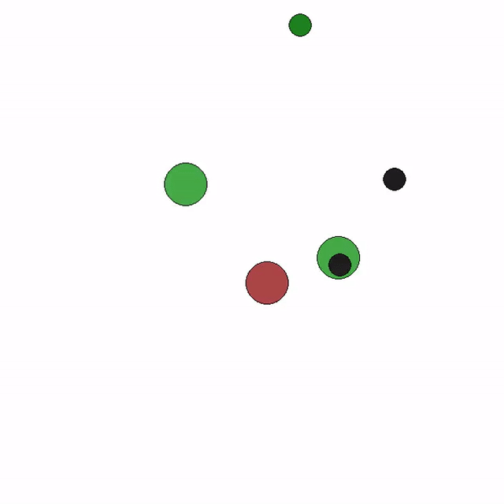
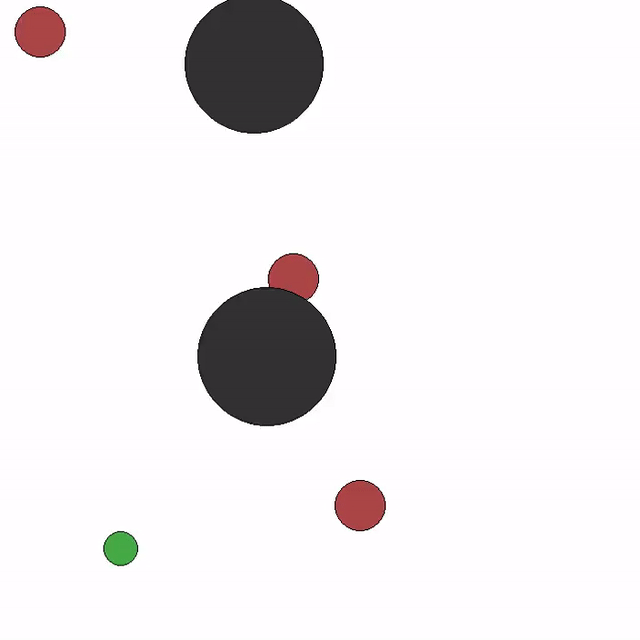
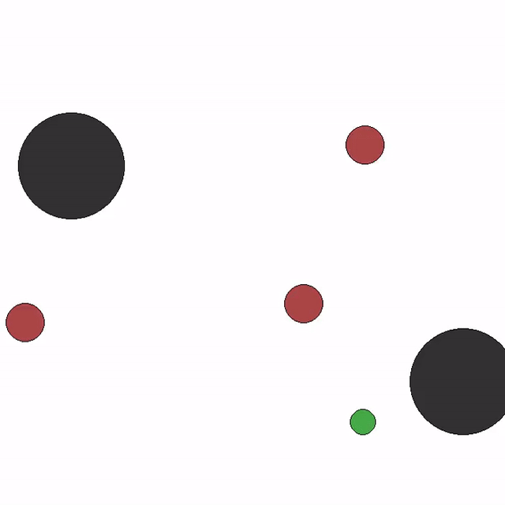
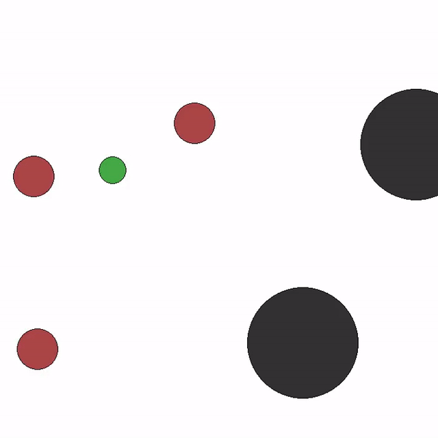
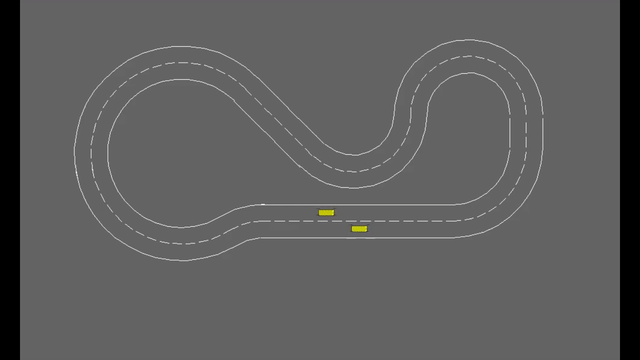
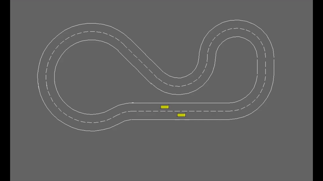
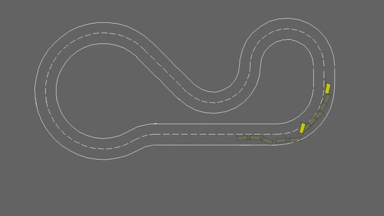
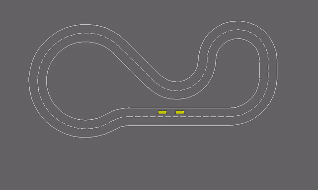

# DiffusionFSP: Learning Behaviors from Scratch via Diffusion-based Fictitious Self-Play

This repository contains supplementary videos for the paper:

> **DiffusionFSP: Learning Behaviors from Scratch via Diffusion-based Fictitious Self-Play**  
> [Under Review]

## 🎥 Supplementary Videos

### MPE - Adversary

  
  
  

<em>MPE - Adversary: Model Stochasticity. We fix the seed and run the evaluation three times to demonstrate the inherent stochasticity in the model. We observe that using DiffFSP leads to learning more diverse strategies</em>

---

### MPE - Tag

  
  
  

<em>MPE - Tag: Qualitative Results (Predator Prey). We observe competitive gameplay, even only when using sparse reward setup.</em>

---
### RaceTrack (Robustness to Unseen Opponents)

  
  
  

<em>Racetrack: Trained agents are shown in yellow, while unseen agents are in blue. We deploy the agents in a more complex setting where they must perform multiple overtakes. Overall, we observe that the agents learn to navigate corners effectively before executing overtakes. In particular, some agents exhibit a block pass behavior—deliberately taking an inside line at a corner to prevent the opponent from passing</em>

---
### RaceTrack (Robustness to Unseen Opponents - Failure Modes)

  
  

<em>
Racetrack: Left (QSMFSP) fails to perform a lane change and instead rear-ends the opponent. The agents make decisions based solely on local observations and do not have access to the full state of all agents. Right: DiffFSP infers the presence of agents ahead and chooses to violate track boundaries in order to overtake them.
</em>

---

### RaceTrack (Overtake - 1)

*The attacking agent car overtakes the defending agent at a turn and then performs a lane change to block any attempt at re-overtaking.*

---

### RaceTrack (Overtake - 2)

*Another instance where the attacking agent executes a strategic overtake at a curve and immediately transitions to a blocking maneuver.*

---

### RaceTrack (Overtake - 2)

  

*Another instance where the attacking agent executes a strategic overtake at a curve and immediately transitions to a blocking maneuver.*

---

### RaceTrack (Block - 1)

*The defending agent performs defensive blocking to prevent the attacjing agent from overtaking, maintaining lane control throughout.*

---

### RaceTrack (Defensive Driving - 1)

*The attacking agent maintains a safe distance and matches the defending car's speed, occasionally performing a shoulder check without attempting to overtake.*

---

### RaceTrack (Overtake Fail - 1)

*The attacking agent fails to complete an overtake, braking at the last moment to avoid a rear-end collision.*

---

### RaceTrack (Brake Check Follower - 1)

*The defending agent executes a brake check, forcing the attacking agent to react defensively to avoid a collision.*

